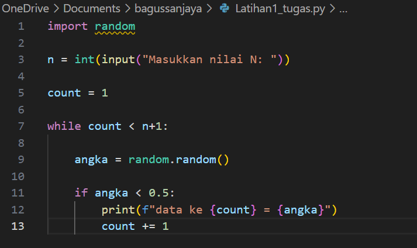
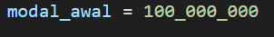
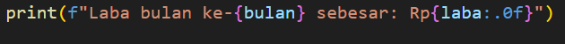
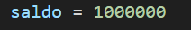

# labpy03

Nama: Bagus Sanjaya

NIM: 312410505

Kelas: TI.24.A.5

## Latihan1

1. Mengimpor modul random:

Random adalah modul bawaan python yang berisi fungsi-fungsi untuk menghasilkan bilangan acak.

2. Meminta input dari pengguna:

Program meminta pengguna untuk memasukan nilai N, yang merupakan jumlah bilangan acak yang ingin ditampilkan.

Fungsi input digunakan untuk mengambil input dari pengguna, dan int digunakan untuk mengonversi input menjadi bilangan bulat.

3. Inisialisasi variabel count:

count diiniaialisasi dengan nilai 1, yang akan digunakan untuk melacak jumlah bilangan acak yang telah ditampilkan.

4. Loop while:

loop while digunakan untuk menjalankan blok kode di dalamnya selama kondisi count < n+1 terpenuhi.

5. Menghasilkan bilangan acak:

random.ramndom() menghasilkan bilangan acak antara 0 dan 1.

6. Mengecek nilai bilangan acak:

Kondisi if digunakan untuk mengecek apakah bilangan acak yang dihasilkan lebih kecil dari 0.5.

7. Menampilkan bilangan acak:

Jika bilangan acak kurang dari 0.5, program akan menampilkan bilangan tersebut dengan format "data ke {count} = {angka}".

Menggunaan f-string untuk menyisipkan nilai count dan angka ke dalam string.

8. Increment count:

count dinaikan satu setelah menampilkan bilangan acak yang valid.

## Ini adalah code pemogramannya:

## Ini adalah hasil pemogramannya

## Latihan2

1. Inisialisasi modal awal:

Mengatur modal awal sebesar Rp 100.000.000.

2. Inisialisasi total keuntungan:

Mengatur total keuntungan awal bulan sebesar 0.

3. Loop untuk menghitung keuntungan setiap bulan:

Loop for digunakan untuk iterasi dari bulan 1 hingga bulan 8 (dalam range(1, 9)).

4. Pengdondisikan untuk menghitung laba berdasarkan bulan:

Kondisi if-elif digunakan untuk menentukan laba per bulan berdasarkan bulan tertentu:

Bulan 1 dan 2: Tidak ada laba (laba = 0).

Bulan 3 dan 4: Laba 1% dari modal awal.

Bulan 5, 6, dan 7: Laba 5% dari modal awal.

Bulan 8: Laba 3% dari modal awal.

5. Menampilkan laba setiap bulan:

Menampilkan laba setiap bulan dalam format yang rapi.

6. Menambahkan Laba Bulanan ke total keuntungan:

Laba bulanan ditambahkan ke total keuntungan secara akumulatif.

7. Menampilkan total keuntungan setelah 8 bulan:

Setelah loop selesai, program akan menampilkan total keuntungan selama 8 bulan.

## Ini adalah code pemogramannya:

## Ini adalah hasil pemogramannya:

## Latihan3

1. Inisialisasi saldo:

Mengatur saldo awal pengguna sebesar Rp1000000.

2. Loop utama:

Program berjalan dalam loop tak terbatas hingga pengguna memilih opsi "Keluar".

3. Menampilkan menu utama dan saldo saat ini:

Menampilkan saldo saat ini dan dua opsi: "Tarik Uang" dan "Keluar".

4. Meminta input pengguna:

Meminta pengguna untuk memilih salah satu opsi: 1(Tarik Uang) atau 2(keluar).

5. Proses penarikan uang:

Jika pengguna memilih opsi 1(Tarik Uang):

Program meminta jumlah penarikan dari penggunna.

Mengecek apakah jumlah penarikan lebih besar dari saldo:

-Jika ya, menampilkan pesan bahwa saldo tidak mencukupi.

-Jika tidak, saldo dikurangi dengan jumlah penarikan.

6. Proses keluar:

Jika pengguna memilih opsi 2(Keluar):

Program menampilkan pesan Terima kasih dan keluar dari loop.

7. Pilihan tidak valid:

Jika pengguna memasukan pilihan yang tidak valid:

Program menampilkan pesan error dan kembali ke menu utama.

## Ini adalah code pemogramannya:

## Ini adalah hasil programnya:

